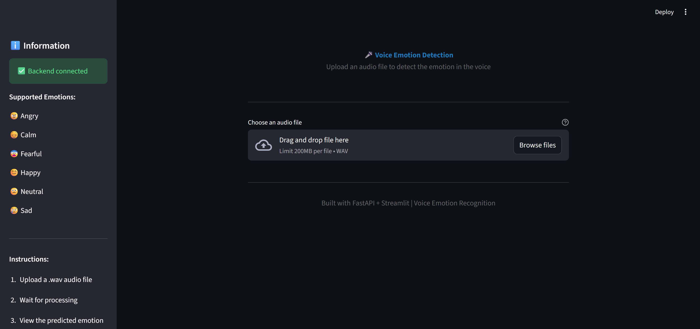
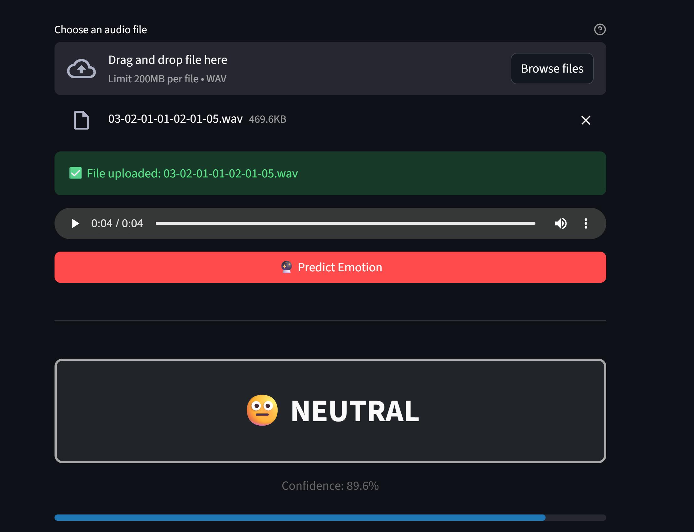
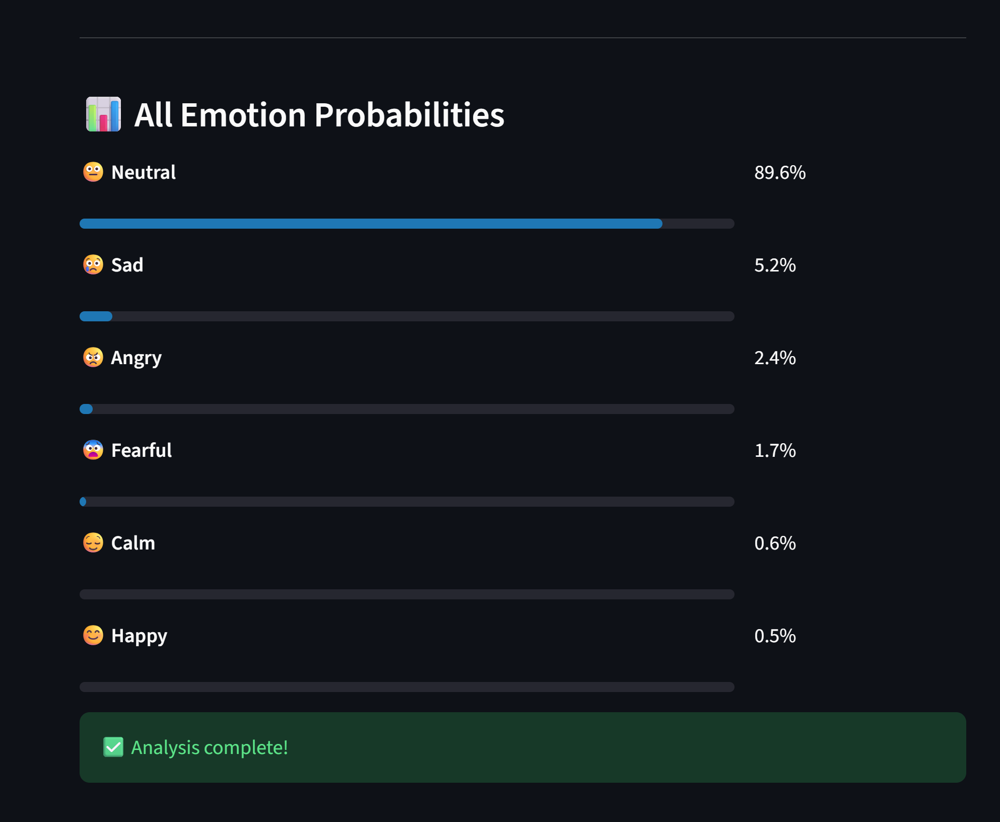

# 🎤 Voice Emotion Detection Web Application

A complete machine learning web application that detects emotions from voice audio using advanced MFCC feature extraction and Random Forest classification.


## 🌟 Features

- **8 Emotion Classes**: Happy, Sad, Angry, Fearful, Disgust, Surprised, Neutral, Calm
- **Advanced ML Pipeline**: MFCC features with delta and delta-delta coefficients (240 features)
- **Production-Ready**: Separate FastAPI backend and Streamlit frontend
- **Real-time Predictions**: Upload audio and get instant emotion predictions
- **Confidence Scores**: See probability distribution across all emotions
- **User-Friendly UI**: Beautiful Streamlit interface with emoji indicators

## 🏗️ Architecture
```
┌─────────────────┐
│   Streamlit UI  │  ← User uploads .wav file
└────────┬────────┘
         │ HTTP Request
         ↓
┌─────────────────┐
│  FastAPI Backend│  ← Audio processing & ML inference
└────────┬────────┘
         │
         ↓
┌─────────────────┐
│  Random Forest  │  ← Trained emotion classifier
│     Model       │
└─────────────────┘
```

## 📁 Project Structure
```
Voice-Emotion-Detection-Web-Application/
├── backend/
│   ├── main.py                    # FastAPI application
│   ├── audio_processor.py         # Audio preprocessing & feature extraction
│   ├── requirements.txt           # Backend dependencies
│   └── models/                    # Trained model files (not in repo)
│       ├── emotion_classifier.joblib
│       ├── label_encoder.joblib
│       └── scaler.joblib
├── frontend/
│   ├── app.py                     # Streamlit application
│   └── requirements.txt           # Frontend dependencies
├── .gitignore
├── README.md
└── LICENSE
```

## 🚀 Quick Start

### Prerequisites

- Python 3.8 or higher
- pip package manager
- Trained model files (see [Model Files](#-model-files) section)

### Installation

1. **Clone the repository**
```bash
   git clone https://github.com/AhmedToto23/Voice-Emotion-Detection-Web-Application.git
   cd Voice-Emotion-Detection-Web-Application
```

2. **Setup Backend**
```bash
   cd backend
   pip install -r requirements.txt
```

3. **Setup Frontend**
```bash
   cd frontend
   pip install -r requirements.txt
```

4. **Add Model Files**
   
   Place your trained model files in `backend/models/`:
   - `emotion_classifier.joblib`
   - `label_encoder.joblib`
   - `scaler.joblib`

### Running the Application

**Terminal 1 - Start Backend:**
```bash
cd backend
python -m uvicorn main:app --reload
```

**Terminal 2 - Start Frontend:**
```bash
cd frontend
streamlit run app.py
```

Open your browser at `http://localhost:8501`

## 📊 Model Details

- **Algorithm**: Random Forest Classifier (300 trees)
- **Features**: 240 dimensions
  - 40 MFCCs (mean + std)
  - 40 Delta MFCCs (mean + std)
  - 40 Delta-Delta MFCCs (mean + std)
- **Audio Processing**: 3.5 seconds, mono, 16kHz
- **Dataset**: RAVDESS (Ryerson Audio-Visual Database)

## 🎯 API Endpoints

### `GET /`
Health check endpoint

**Response:**
```json
{
  "status": "online",
  "message": "Voice Emotion Detection API",
  "version": "1.0.0"
}
```

### `GET /emotions`
Get list of supported emotions

**Response:**
```json
{
  "emotions": ["angry", "calm", "disgust", "fearful", "happy", "neutral", "sad", "surprised"],
  "count": 8
}
```

### `POST /predict`
Predict emotion from audio file

**Request:** Multipart form-data with `.wav` file

**Response:**
```json
{
  "emotion": "happy",
  "confidence": 0.85,
  "all_probabilities": {
    "happy": 0.85,
    "neutral": 0.10,
    "calm": 0.03,
    ...
  },
  "valid": true
}
```

## 📦 Model Files

The trained model files are **not included** in this repository due to size constraints.

**Option 1: Train Your Own**
- Use the Jupyter notebook (if provided) to train on RAVDESS dataset
- Models will be saved in `backend/models/`

**Option 2: Download Pre-trained Models**
- [Download from Google Drive](#) *(https://drive.google.com/drive/folders/1__6iWDGlBW6oY6Hvdg83NpgtKc_Xginc?usp=sharing)*
- Extract to `backend/models/`

## 🌐 Deploy Online

### Using ngrok (for demo)

1. **Start backend normally**
2. **In new terminal, run:**
```bash
   ngrok http 8000
```
3. **Copy ngrok URL** (e.g., `https://xxxx.ngrok.io`)
4. **Update frontend** `app.py` line 13:
```python
   BACKEND_URL = "https://xxxx.ngrok.io"
```
5. **Restart Streamlit** and share!

### Production Deployment

- **Backend**: Deploy to AWS EC2, Google Cloud Run, or Heroku
- **Frontend**: Deploy to Streamlit Cloud (free)
- **Models**: Store in S3 or similar cloud storage

## 🛠️ Technology Stack

**Backend:**
- FastAPI - Modern Python web framework
- librosa - Audio analysis library
- scikit-learn - Machine learning library
- joblib - Model serialization

**Frontend:**
- Streamlit - Interactive web UI
- requests - HTTP client

## 📸 Screenshots

*

*

## 🤝 Contributing

Contributions are welcome! Please feel free to submit a Pull Request.

1. Fork the repository
2. Create your feature branch (`git checkout -b feature/AmazingFeature`)
3. Commit your changes (`git commit -m 'Add some AmazingFeature'`)
4. Push to the branch (`git push origin feature/AmazingFeature`)
5. Open a Pull Request

## 📄 License

This project is licensed under the MIT License - see the [LICENSE](LICENSE) file for details.

## 🙏 Acknowledgments

- **RAVDESS Dataset**: Livingstone SR, Russo FA (2018) The Ryerson Audio-Visual Database of Emotional Speech and Song (RAVDESS)
- Built with FastAPI and Streamlit
- Inspired by speech emotion recognition research


## 🐛 Troubleshooting

**Backend won't start:**
- Verify model files exist in `backend/models/`
- Check all dependencies: `pip install -r requirements.txt`

**"Backend not available" error:**
- Ensure FastAPI is running on port 8000
- Check `BACKEND_URL` in `frontend/app.py`

**"Invalid audio" error:**
- Ensure file is `.wav` format
- Audio should be clear and not too quiet
- Recommended: 3-4 seconds duration

---

⭐ **Star this repo** if you found it helpful!
```
